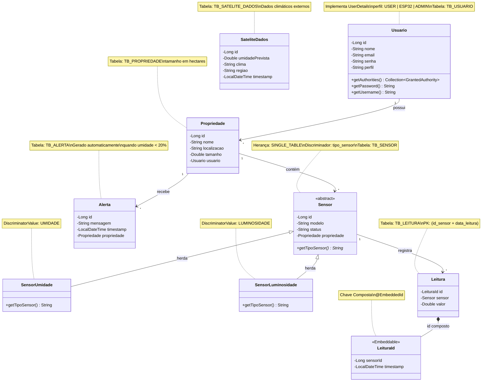
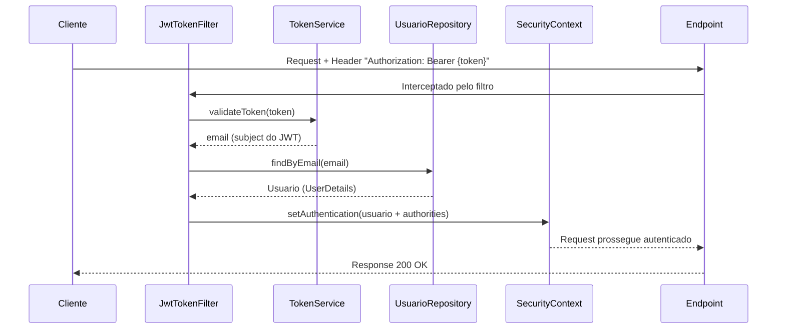

<div align="center">

# 🌱 AgroID — Monitoramento Agrícola Inteligente


**API REST robusta desenvolvida em Java 21 + Spring Boot 3.2.5 com integração ao banco Oracle SQL.**
Camada de inteligência que orquestra dados de sensores IoT (ESP32), dados climáticos de satélite e o aplicativo mobile (React Native), oferecendo irrigação automatizada e relatórios analíticos em tempo real.

</div>

---

## 📑 Índice

- [Visão Geral do Projeto](#-visão-geral-do-projeto)
- [Arquitetura da Aplicação](#-arquitetura-da-aplicação)
- [Tecnologias Utilizadas](#-tecnologias-utilizadas)
- [Diagrama de Classes (UML)](#-diagrama-de-classes-uml)
- [Modelo Entidade-Relacionamento (ER)](#-modelo-entidade-relacionamento-er)
- [Modelagem Avançada do Banco de Dados](#-modelagem-avançada-do-banco-de-dados)
- [Scripts DML — Exemplos de Manipulação de Dados](#-scripts-dml--exemplos-de-manipulação-de-dados)
- [PL/SQL — Procedures, Cursores e Views](#-plsql--procedures-cursores-e-views)
- [Estrutura de Pacotes e Classes](#-estrutura-de-pacotes-e-classes)
- [Endpoints da API (Referência Completa)](#-endpoints-da-api-referência-completa)
- [Segurança — Spring Security + JWT](#-segurança--spring-security--jwt)
- [HATEOAS — Hipermídia como Motor do Estado da Aplicação](#-hateoas--hipermídia-como-motor-do-estado-da-aplicação)
- [Tratamento Global de Exceções](#-tratamento-global-de-exceções)
- [Pré-requisitos](#-pré-requisitos)
- [Instalação e Execução](#-instalação-e-execução)
- [Deploy e Link Público](#-deploy-e-link-público)
- [Ajustes e Melhorias Futuras](#️-ajustes-e-melhorias-futuras)
- [Colaboradores](#-colaboradores)
- [Licença](#-licença)

---

## 🌍 Visão Geral do Projeto

O **AgroID** é um sistema de **monitoramento agrícola inteligente** que integra três camadas:

| Camada | Tecnologia | Responsabilidade |
|--------|-----------|-----------------|
| **IoT (Hardware)** | ESP32 + Sensores | Coleta dados brutos de umidade e luminosidade do solo e envia via HTTP `POST` para a API |
| **Backend (API)** | Java + Spring Boot + Oracle | Recebe, valida, persiste os dados, executa regras de negócio (irrigação automática) e expõe endpoints REST |
| **Frontend (Mobile)** | React Native | Consome os dados da API via `GET` e exibe dashboards em tempo real para o agricultor |

### 🔄 Fluxo de Dados Completo

```
┌──────────┐      POST /api/leituras       ┌─────────────────────┐      GET /api/*       ┌──────────────┐
│  ESP32   │ ──────── (JSON + JWT) ────────▶│  API Spring Boot    │◀──── (JSON + JWT) ────│  App Mobile  │
│ Sensores │                                │  (Validação + ORM)  │                       │ React Native │
└──────────┘                                └─────────┬───────────┘                       └──────────────┘
                                                      │
                                                      │ JPA / Hibernate
                                                      ▼
                                              ┌───────────────┐
                                              │  Oracle SQL   │
                                              │  + PL/SQL     │
                                              │  + Views      │
                                              └───────────────┘
```

---

## 🏗️ Arquitetura da Aplicação

A aplicação segue a **Arquitetura em Camadas (Layered Architecture)** com separação clara de responsabilidades:

```
┌─────────────────────────────────────────────────────────────┐
│                     CONTROLLER LAYER                        │
│   AuthController · SensorController · PropriedadeController │
│   LeituraController · AlertaController · SateliteDadosCtrl  │
├─────────────────────────────────────────────────────────────┤
│                       DTO LAYER                             │
│  Request DTOs (Java Records + @Valid)  ⇄  Response DTOs     │
├─────────────────────────────────────────────────────────────┤
│                      SERVICE LAYER                          │
│    AuthService · SensorService · PropriedadeService         │
│    LeituraService · AlertaService · SateliteDadosService    │
├─────────────────────────────────────────────────────────────┤
│                    REPOSITORY LAYER                         │
│      JpaRepository<T, ID> (Spring Data JPA)                 │
├─────────────────────────────────────────────────────────────┤
│                       MODEL LAYER                           │
│  Sensor (abstract) → SensorUmidade / SensorLuminosidade     │
│  Usuario (UserDetails) · Propriedade · Leitura · Alerta     │
│  LeituraId (@Embeddable) · SateliteDados                    │
├─────────────────────────────────────────────────────────────┤
│                     SECURITY LAYER                          │
│     SecurityConfig · TokenService · JwtTokenFilter          │
├─────────────────────────────────────────────────────────────┤
│                    EXCEPTION LAYER                          │
│  GlobalExceptionHandler (@ControllerAdvice)                 │
│  ResourceNotFoundException · CustomValidationException      │
└─────────────────────────────────────────────────────────────┘
```

---

## 🛠️ Tecnologias Utilizadas

| Categoria | Tecnologia | Versão |
|-----------|-----------|--------|
| Linguagem | Java | 21 |
| Framework | Spring Boot | 3.2.5 |
| REST | Spring Web + HATEOAS | — |
| Persistência | Spring Data JPA + Hibernate | — |
| Banco de Dados | Oracle SQL (ojdbc11) | — |
| Segurança | Spring Security + JWT (Auth0 java-jwt) | 4.4.0 |
| Validação | Spring Validation (Bean Validation 3.0) | — |
| Produtividade | Lombok | 1.18.46 |
| Dev Tools | Spring Boot DevTools | — |
| Documentação | Springdoc OpenAPI (Swagger UI) | 2.3.0 |
| Build | Apache Maven | 3.8+ |
| Testes | Spring Boot Test + Spring Security Test | — |

---

## 📐 Diagrama de Classes (UML)

O diagrama abaixo ilustra todas as entidades JPA, seus atributos, relacionamentos e a estratégia de herança utilizada:



---

## 🗃️ Modelo Entidade-Relacionamento (ER)

O diagrama ER abaixo representa a estrutura física do banco de dados Oracle, incluindo chaves primárias, estrangeiras, constraints e sequences:

```mermaid
erDiagram
    TB_USUARIO {
        NUMBER id_usuario PK
        VARCHAR2 nome
        VARCHAR2 email UK
        VARCHAR2 senha
        VARCHAR2 perfil "CHECK: USER, ESP32, ADMIN"
    }

    TB_PROPRIEDADE {
        NUMBER id_propriedade PK
        VARCHAR2 nome
        VARCHAR2 localizacao
        NUMBER tamanho "hectares"
        NUMBER id_usuario FK
    }

    TB_SENSOR {
        NUMBER id_sensor PK
        VARCHAR2 tipo_sensor "CHECK: UMIDADE, LUMINOSIDADE"
        VARCHAR2 modelo
        VARCHAR2 status "CHECK: ATIVO, INATIVO"
        NUMBER id_propriedade FK
    }

    TB_LEITURA {
        NUMBER id_sensor PK_FK
        TIMESTAMP data_leitura PK
        NUMBER valor
    }

    TB_ALERTA {
        NUMBER id_alerta PK
        VARCHAR2 mensagem
        TIMESTAMP data_alerta
        NUMBER id_propriedade FK
    }

    TB_SATELITE_DADOS {
        NUMBER id_satelite PK
        NUMBER umidade_prevista
        VARCHAR2 clima
        VARCHAR2 regiao
        TIMESTAMP data_coleta
    }

    TB_USUARIO ||--o{ TB_PROPRIEDADE : "possui"
    TB_PROPRIEDADE ||--o{ TB_SENSOR : "contém"
    TB_PROPRIEDADE ||--o{ TB_ALERTA : "recebe"
    TB_SENSOR ||--o{ TB_LEITURA : "registra"
```

### Sequences (Auto-Incremento)

| Sequence | Tabela Associada | Início | Incremento |
|----------|-----------------|--------|-----------|
| `SEQ_USUARIO` | TB_USUARIO | 1 | 1 |
| `SEQ_PROPRIEDADE` | TB_PROPRIEDADE | 1 | 1 |
| `SEQ_SENSOR` | TB_SENSOR | 1 | 1 |
| `SEQ_ALERTA` | TB_ALERTA | 1 | 1 |
| `SEQ_SATELITE` | TB_SATELITE_DADOS | 1 | 1 |

---

## 🧬 Modelagem Avançada do Banco de Dados

### 1. Herança com `@Inheritance(SINGLE_TABLE)`

A entidade `Sensor` é uma **classe abstrata** que utiliza a estratégia de **tabela única** para herança. Todos os tipos de sensor são armazenados em uma única tabela (`TB_SENSOR`), diferenciados pela coluna discriminadora `tipo_sensor`:

```java
@Entity
@Table(name = "TB_SENSOR")
@Inheritance(strategy = InheritanceType.SINGLE_TABLE)
@DiscriminatorColumn(name = "tipo_sensor", discriminatorType = DiscriminatorType.STRING)
public abstract class Sensor {
    // Atributos comuns a todos os tipos de sensor
}

@Entity
@DiscriminatorValue("UMIDADE")
public class SensorUmidade extends Sensor { ... }

@Entity
@DiscriminatorValue("LUMINOSIDADE")
public class SensorLuminosidade extends Sensor { ... }
```

**Por que SINGLE_TABLE?** É a estratégia mais performática para consultas, pois o Hibernate não precisa fazer `JOIN` entre tabelas. Ideal quando as subclasses compartilham a maioria dos atributos.

### 2. Chave Composta com `@EmbeddedId`

A tabela `TB_LEITURA` utiliza uma **chave primária composta** formada por `id_sensor` + `data_leitura`, garantindo que cada leitura é única por sensor e timestamp:

```java
@Embeddable
public class LeituraId implements Serializable {
    @Column(name = "id_sensor")
    private Long sensorId;

    @Column(name = "data_leitura")
    private LocalDateTime timestamp;
}

@Entity
@Table(name = "TB_LEITURA")
public class Leitura {
    @EmbeddedId
    private LeituraId id;

    @MapsId("sensorId")
    @ManyToOne(fetch = FetchType.LAZY)
    private Sensor sensor;
}
```

**Justificativa:** Modelar o histórico de leituras com chave composta elimina a necessidade de um ID sintético (auto-incremento) e reforça a unicidade natural dos dados de telemetria IoT.

### 3. Múltiplas Tabelas com Relacionamentos

O sistema possui **6 tabelas** interconectadas com chaves estrangeiras e constraints de integridade:

| Relacionamento | Tipo | Constraint |
|---------------|------|-----------|
| Usuario → Propriedade | 1:N | `FK + ON DELETE CASCADE` |
| Propriedade → Sensor | 1:N | `FK + ON DELETE CASCADE` |
| Sensor → Leitura | 1:N | `FK + ON DELETE CASCADE` |
| Propriedade → Alerta | 1:N | `FK + ON DELETE CASCADE` |

---

## 📝 Scripts DML — Exemplos de Manipulação de Dados

Abaixo estão exemplos reais de como os dados são inseridos e consultados no sistema:

### INSERT — Cadastrar Usuário
```sql
INSERT INTO TB_USUARIO (id_usuario, nome, email, senha, perfil)
VALUES (SEQ_USUARIO.NEXTVAL, 'Gabriel Maciel', 'gabriel@fiap.com.br', '$2a$10$hashBCrypt...', 'ADMIN');
```

### INSERT — Cadastrar Propriedade
```sql
INSERT INTO TB_PROPRIEDADE (id_propriedade, nome, localizacao, tamanho, id_usuario)
VALUES (SEQ_PROPRIEDADE.NEXTVAL, 'Fazenda Santa Cruz', 'Ribeirão Preto, SP', 150.75, 1);
```

### INSERT — Cadastrar Sensor na Propriedade
```sql
INSERT INTO TB_SENSOR (id_sensor, tipo_sensor, modelo, status, id_propriedade)
VALUES (SEQ_SENSOR.NEXTVAL, 'UMIDADE', 'DHT22-v3', 'ATIVO', 1);
```

### INSERT — Registrar Leitura do ESP32
```sql
INSERT INTO TB_LEITURA (id_sensor, data_leitura, valor)
VALUES (1, SYSTIMESTAMP, 18.50);
```

### SELECT — Relatório com JOIN (Performance por Propriedade)
```sql
SELECT u.nome AS proprietario, p.nome AS propriedade, s.tipo_sensor,
       COUNT(l.valor) AS total_leituras,
       ROUND(AVG(l.valor), 2) AS media,
       MIN(l.valor) AS minimo,
       MAX(l.valor) AS maximo
FROM TB_USUARIO u
JOIN TB_PROPRIEDADE p ON u.id_usuario = p.id_usuario
JOIN TB_SENSOR s ON p.id_propriedade = s.id_propriedade
LEFT JOIN TB_LEITURA l ON s.id_sensor = l.id_sensor
GROUP BY u.nome, p.nome, s.tipo_sensor;
```

### UPDATE — Alterar Status de Sensor
```sql
UPDATE TB_SENSOR SET status = 'INATIVO' WHERE id_sensor = 1;
```

### DELETE — Remover Propriedade (Cascata)
```sql
DELETE FROM TB_PROPRIEDADE WHERE id_propriedade = 1;
-- Remove em cascata: Sensores, Leituras e Alertas vinculados
```

---

## 🔮 PL/SQL — Procedures, Cursores e Views

O projeto inclui **3 procedures e 2 views** no Oracle que implementam lógica de negócio avançada no banco de dados:

### Procedure 1: `PROC_RELATORIO_RISCO` — Cursor Explícito

Percorre todas as propriedades com um **cursor explícito**, identifica as que possuem umidade abaixo de 20% na última leitura e insere um alerta automático na `TB_ALERTA`.

```sql
CURSOR cur_propriedades_criticas IS
    SELECT p.id_propriedade, p.nome, s.id_sensor, l.valor
    FROM TB_PROPRIEDADE p
    JOIN TB_SENSOR s ON p.id_propriedade = s.id_propriedade
    JOIN TB_LEITURA l ON s.id_sensor = l.id_sensor
    WHERE s.tipo_sensor = 'UMIDADE'
      AND l.valor < 20.00;

FOR reg IN cur_propriedades_criticas LOOP
    INSERT INTO TB_ALERTA (...) VALUES (...);
END LOOP;
```

**Conceitos demonstrados:** Cursor explícito, `FOR...LOOP`, `INSERT` dinâmico, `COMMIT`, `EXCEPTION WHEN OTHERS`.

---

### Procedure 2: `PROC_CALCULAR_MEDIA_24H` — Decisão e Loop

Calcula a **média de umidade das últimas 24 horas** para cada propriedade. Se estiver abaixo de 40%, dispara um alerta preventivo.

```sql
FOR prop IN cur_propriedades LOOP
    SELECT AVG(l.valor) INTO v_media ...
    WHERE l.data_leitura >= (SYSTIMESTAMP - INTERVAL '1' DAY);

    IF v_media IS NOT NULL THEN
        IF v_media < 40.00 THEN
            INSERT INTO TB_ALERTA (...);
        END IF;
    END IF;
END LOOP;
```

**Conceitos demonstrados:** Cursor, `FOR...LOOP`, estrutura `IF/ELSE`, variável `CONSTANT`, função `AVG()`, `INTERVAL`.

---

### Procedure 3: `PROC_INSERIR_LEITURA` — Tratamento de Exceção

Insere uma leitura com tratamento de erros específicos do Oracle:

```sql
EXCEPTION
    WHEN fk_not_found THEN   -- ORA-02291: FK inexistente
        RAISE_APPLICATION_ERROR(-20001, 'Sensor informado não existe.');
    WHEN dup_key THEN         -- ORA-00001: PK duplicada
        RAISE_APPLICATION_ERROR(-20002, 'Registro duplicado no mesmo timestamp.');
    WHEN OTHERS THEN
        ROLLBACK;
        RAISE;
```

**Conceitos demonstrados:** `PRAGMA EXCEPTION_INIT`, exceções customizadas, `RAISE_APPLICATION_ERROR`, `ROLLBACK`.

---

### View 1: `VW_PERFORMANCE_PROPRIEDADE`

Relatório consolidado com **JOIN de 4 tabelas** (Usuario + Propriedade + Sensor + Leitura):

```
| proprietario | propriedade       | tipo_sensor | total_leituras | media | min  | max  |
|-------------|-------------------|-------------|----------------|-------|------|------|
| Gabriel     | Fazenda Santa Cruz | UMIDADE     | 152            | 45.23 | 8.50 | 92.10|
```

### View 2: `VW_SENSORES_SEM_LEITURA_RECENTE`

Identifica sensores inativos ou sem leituras há mais de 1 hora usando **LEFT JOIN**:

```
| id_sensor | tipo_sensor | modelo  | propriedade        | status_atividade          |
|-----------|------------|---------|--------------------|-----------------------------|
| 3         | UMIDADE    | DHT22   | Sítio Esperança     | Inativo/Sem leitura recente |
```

---

## 📦 Estrutura de Pacotes e Classes

```
src/main/java/com/gs/agroid/
│
├── AgroidApplication.java              # Classe principal (@SpringBootApplication)
│
├── model/                              # 📌 Entidades JPA
│   ├── Usuario.java                    # Usuário do sistema (implementa UserDetails)
│   ├── Propriedade.java                # Propriedade rural / área monitorada
│   ├── Sensor.java                     # Classe abstrata base (herança SINGLE_TABLE)
│   ├── SensorUmidade.java              # Sensor de umidade do solo (extends Sensor)
│   ├── SensorLuminosidade.java         # Sensor de luminosidade (extends Sensor)
│   ├── Leitura.java                    # Registro de leitura bruta do ESP32
│   ├── LeituraId.java                  # Chave composta @Embeddable (sensor + timestamp)
│   ├── Alerta.java                     # Alarme disparado por leitura crítica
│   └── SateliteDados.java              # Dados climáticos via satélite
│
├── dto/                                # 📌 Data Transfer Objects (Java Records)
│   ├── LoginRequestDto.java            # Payload de login (email + senha)
│   ├── LoginResponseDto.java           # Resposta de login (token + email + perfil)
│   ├── RegisterRequestDto.java         # Cadastro de usuário (com @Valid)
│   ├── SensorRequestDto.java           # Criação/edição de sensor (com @Pattern)
│   ├── SensorResponseDto.java          # Retorno de sensor (sem dados sensíveis)
│   ├── PropriedadeRequestDto.java      # Criação/edição de propriedade
│   ├── PropriedadeResponseDto.java     # Retorno com HATEOAS (extends RepresentationModel)
│   ├── LeituraRequestDto.java          # Payload enviado pelo ESP32
│   └── LeituraResponseDto.java         # Retorno de leitura formatado
│
├── repository/                         # 📌 Repositórios (Spring Data JPA)
│   ├── UsuarioRepository.java          # findByEmail() para autenticação
│   ├── PropriedadeRepository.java      # CRUD padrão de propriedades
│   ├── SensorRepository.java           # findByPropriedadeId() para listar por área
│   ├── LeituraRepository.java          # findByIdSensorIdOrderByIdTimestampDesc()
│   ├── AlertaRepository.java           # findByPropriedadeId() para alertas por área
│   └── SateliteDadosRepository.java    # findByRegiao() para dados por região
│
├── service/                            # 📌 Camada de Negócio
│   ├── AuthService.java                # Login, Register + UserDetailsService
│   ├── SensorService.java              # CRUD + factory de herança (Umidade/Luminosidade)
│   ├── PropriedadeService.java         # CRUD completo de propriedades
│   ├── LeituraService.java             # Recebe dados do ESP32 + trigger irrigação
│   ├── AlertaService.java              # Consulta alertas por propriedade
│   └── SateliteDadosService.java       # CRUD de dados satelitais
│
├── controller/                         # 📌 Endpoints REST
│   ├── AuthController.java             # POST /api/auth/login e /register
│   ├── SensorController.java           # CRUD /api/sensores + GET /{id}/leituras
│   ├── PropriedadeController.java      # CRUD /api/areas + HATEOAS + GET /{id}/sensores
│   ├── LeituraController.java          # POST /api/leituras (exclusivo ESP32)
│   ├── AlertaController.java           # GET /api/alertas/propriedade/{id}
│   └── SateliteDadosController.java    # POST + GET /api/satelite
│
├── security/                           # 📌 Segurança JWT
│   ├── SecurityConfig.java             # Configuração de filtros, CORS e permissões
│   ├── TokenService.java               # Geração e validação de tokens JWT (HMAC256)
│   └── JwtTokenFilter.java             # Filtro que intercepta requests e valida JWT
│
└── exception/                          # 📌 Tratamento de Erros
    ├── GlobalExceptionHandler.java     # @ControllerAdvice com handlers para cada exceção
    ├── ResourceNotFoundException.java  # HTTP 404 — recurso não encontrado
    └── CustomValidationException.java  # HTTP 400 — erro de validação de negócio
```

### Detalhamento por Camada

<details>
<summary><b>📌 Model — Entidades JPA (Clique para expandir)</b></summary>

| Classe | Tabela | Responsabilidade | Padrões Avançados |
|--------|--------|-----------------|-------------------|
| `Usuario` | TB_USUARIO | Representação do usuário com autenticação integrada ao Spring Security | Implementa `UserDetails`, retorna `ROLE_{perfil}` nas authorities |
| `Propriedade` | TB_PROPRIEDADE | Área rural monitorada, vinculada a um usuário | `@ManyToOne(LAZY)` para Usuario |
| `Sensor` | TB_SENSOR | Classe **abstrata** que modela qualquer sensor | `@Inheritance(SINGLE_TABLE)` + `@DiscriminatorColumn` |
| `SensorUmidade` | TB_SENSOR | Especialização para sensores de umidade do solo | `@DiscriminatorValue("UMIDADE")`, Builder pattern |
| `SensorLuminosidade` | TB_SENSOR | Especialização para sensores de luminosidade | `@DiscriminatorValue("LUMINOSIDADE")`, Builder pattern |
| `Leitura` | TB_LEITURA | Dado bruto enviado pelo ESP32 | `@EmbeddedId` com `LeituraId` (chave composta) |
| `LeituraId` | — | Classe embeddable da chave composta | `@Embeddable`, `Serializable`, sensor_id + timestamp |
| `Alerta` | TB_ALERTA | Registro de alarme gerado automaticamente | Criado pela `LeituraService` quando umidade < 20% |
| `SateliteDados` | TB_SATELITE_DADOS | Dados climáticos capturados por satélite | Entidade independente, sem FK para outras tabelas |

</details>

<details>
<summary><b>📌 DTO — Data Transfer Objects (Clique para expandir)</b></summary>

Os DTOs de **request** são implementados com **Java Records** (imutáveis, sem boilerplate), combinados com anotações do **Bean Validation**:

| DTO | Tipo | Validações Aplicadas |
|-----|------|---------------------|
| `LoginRequestDto` | Record | `@NotBlank` email, `@NotBlank` senha |
| `RegisterRequestDto` | Record | `@NotBlank` nome/email/senha/perfil, `@Email`, `@Size(min=6)`, `@Pattern(USER\|ESP32\|ADMIN)` |
| `SensorRequestDto` | Record | `@NotBlank` tipoSensor, `@Pattern(UMIDADE\|LUMINOSIDADE)`, `@NotNull` propriedadeId |
| `LeituraRequestDto` | Record | `@NotNull` sensorId/valor, `@Min(0)` valor, timestamp opcional |
| `PropriedadeRequestDto` | Record | `@NotBlank` nome/localizacao, `@NotNull` tamanho/usuarioId |
| `SensorResponseDto` | Class | Lombok `@Builder` para construção fluente |
| `PropriedadeResponseDto` | Class | Extends `RepresentationModel` para HATEOAS |
| `LoginResponseDto` | Record | Retorna token + email + perfil |
| `LeituraResponseDto` | Record | Retorna sensorId + timestamp + valor |

</details>

<details>
<summary><b>📌 Service — Regras de Negócio (Clique para expandir)</b></summary>

| Service | Responsabilidades Principais |
|---------|------------------------------|
| `AuthService` | Implementa `UserDetailsService`. Login com verificação BCrypt, registro com hash de senha. Gera JWT via `TokenService`. Impede e-mails duplicados. |
| `SensorService` | **Factory Pattern** na criação: decide entre `SensorUmidade` e `SensorLuminosidade` com base no `tipoSensor` do DTO. CRUD completo com `@Transactional`. |
| `LeituraService` | Recebe dados do ESP32, monta chave composta (`LeituraId`), valida range de umidade (0-100%). **Trigger de irrigação automática** quando valor < 20%. |
| `PropriedadeService` | CRUD completo, associa propriedade ao `Usuario` via ID. |
| `AlertaService` | Consulta alertas por propriedade. Alertas são criados automaticamente pela `LeituraService`. |
| `SateliteDadosService` | CRUD de dados climáticos, consulta por região. |

**Destaque: Irrigação Automática**

Quando a `LeituraService` recebe uma leitura de umidade **abaixo de 20%**, o método `triggerIrrigacao()` é disparado automaticamente:
1. Loga no console `[SISTEMA DE IRRIGAÇÃO] >>> DISPARANDO IRRIGAÇÃO AUTOMÁTICA`
2. Cria um registro na `TB_ALERTA` com a mensagem de irrigação ativada
3. O App Mobile pode então consultar esses alertas em tempo real

</details>

---

## 🔌 Endpoints da API (Referência Completa)

### 🔓 Autenticação (`/api/auth`)

| Método | Endpoint | Acesso | Descrição | Body |
|--------|----------|--------|-----------|------|
| `POST` | `/api/auth/register` | 🌐 Público | Cadastra novo usuário | `{ nome, email, senha, perfil }` |
| `POST` | `/api/auth/login` | 🌐 Público | Autentica e retorna JWT | `{ email, senha }` |

### 🌾 Propriedades (`/api/areas`)

| Método | Endpoint | Acesso | Descrição | HATEOAS |
|--------|----------|--------|-----------|---------|
| `POST` | `/api/areas` | 🔒 USER/ADMIN | Cria nova propriedade | ✅ self + sensores |
| `GET` | `/api/areas` | 🔒 USER/ADMIN | Lista todas propriedades | ✅ CollectionModel |
| `GET` | `/api/areas/{id}` | 🔒 USER/ADMIN | Busca por ID | ✅ self + sensores |
| `GET` | `/api/areas/{id}/sensores` | 🔒 USER/ADMIN | Sensores da área | — |
| `PUT` | `/api/areas/{id}` | 🔒 USER/ADMIN | Atualiza propriedade | ✅ self + sensores |
| `DELETE` | `/api/areas/{id}` | 🔒 USER/ADMIN | Remove (cascata) | — |

### 📡 Sensores (`/api/sensores`)

| Método | Endpoint | Acesso | Descrição |
|--------|----------|--------|-----------|
| `POST` | `/api/sensores` | 🔒 USER/ADMIN | Cadastra sensor (UMIDADE ou LUMINOSIDADE) |
| `GET` | `/api/sensores` | 🔒 USER/ADMIN | Lista todos sensores |
| `GET` | `/api/sensores/{id}` | 🔒 USER/ADMIN | Busca sensor por ID |
| `GET` | `/api/sensores/{id}/leituras` | 🔒 USER/ADMIN | Histórico de leituras do sensor |
| `PUT` | `/api/sensores/{id}` | 🔒 USER/ADMIN | Atualiza sensor |
| `DELETE` | `/api/sensores/{id}` | 🔒 USER/ADMIN | Remove sensor |

### 📊 Leituras (`/api/leituras`)

| Método | Endpoint | Acesso | Descrição |
|--------|----------|--------|-----------|
| `POST` | `/api/leituras` | 🔒 **ESP32** | Envia leitura do sensor (dispara irrigação se umidade < 20%) |

### ⚠️ Alertas (`/api/alertas`)

| Método | Endpoint | Acesso | Descrição |
|--------|----------|--------|-----------|
| `GET` | `/api/alertas/propriedade/{id}` | 🔒 USER/ADMIN | Lista alertas da propriedade |

### 🛰️ Satélite (`/api/satelite`)

| Método | Endpoint | Acesso | Descrição |
|--------|----------|--------|-----------|
| `POST` | `/api/satelite` | 🔒 USER/ADMIN | Cadastra dados climáticos |
| `GET` | `/api/satelite/regiao/{regiao}` | 🔒 USER/ADMIN | Busca dados por região |

### 📚 Documentação

| Endpoint | Descrição |
|----------|-----------|
| `/swagger-ui.html` | Interface gráfica do Swagger |
| `/v3/api-docs` | Especificação OpenAPI 3.0 em JSON |

---

## 🔐 Segurança — Spring Security + JWT

### Arquitetura de Segurança



### Dois Perfis de Token JWT

| Perfil | Expiração | Caso de Uso | Papel (Role) |
|--------|----------|-------------|-------------|
| `USER` / `ADMIN` | **2 horas** | Usuários do App Mobile ou Web | `ROLE_USER` / `ROLE_ADMIN` |
| `ESP32` | **1 ano** | Dispositivos IoT embarcados | `ROLE_ESP32` |

**O ESP32 recebe um token de longa duração** porque é um dispositivo embarcado que precisa operar sem intervenção humana. Já o token de usuários humanos expira em 2 horas por segurança.

### Configuração de Permissões

```java
.authorizeHttpRequests(authorize -> authorize
    // Públicos
    .requestMatchers(POST, "/api/auth/login").permitAll()
    .requestMatchers(POST, "/api/auth/register").permitAll()
    .requestMatchers("/swagger-ui/**", "/v3/api-docs/**").permitAll()
    // Exclusivo ESP32
    .requestMatchers(POST, "/api/leituras").hasRole("ESP32")
    // App Mobile
    .requestMatchers("/api/areas/**").hasAnyRole("USER", "ADMIN")
    .requestMatchers("/api/sensores/**").hasAnyRole("USER", "ADMIN")
    .anyRequest().authenticated()
)
```

### CORS Configurado

A API permite requisições de **qualquer origem** (`*`) para facilitar integração com o app mobile React Native:

```java
configuration.setAllowedOrigins(List.of("*"));
configuration.setAllowedMethods(List.of("GET", "POST", "PUT", "DELETE", "OPTIONS"));
configuration.setAllowedHeaders(List.of("Authorization", "Content-Type"));
```

---

## 🔗 HATEOAS — Hipermídia como Motor do Estado da Aplicação

O controller de `Propriedade` implementa **HATEOAS** utilizando `RepresentationModel` e `WebMvcLinkBuilder`:

```json
{
  "id": 1,
  "nome": "Fazenda Santa Cruz",
  "localizacao": "Ribeirão Preto, SP",
  "tamanho": 150.75,
  "usuarioId": 1,
  "_links": {
    "self": {
      "href": "http://localhost:8080/api/areas/1"
    },
    "sensores": {
      "href": "/api/areas/1/sensores"
    }
  }
}
```

A resposta de listagem utiliza `CollectionModel` para encapsular a coleção com link `self` do endpoint de listagem.

---

## 🚨 Tratamento Global de Exceções

A classe `GlobalExceptionHandler` (`@ControllerAdvice`) intercepta exceções de toda a aplicação e retorna respostas **padronizadas** em JSON:

| Exceção | HTTP Status | Campo `error` |
|---------|------------|---------------|
| `ResourceNotFoundException` | `404 NOT FOUND` | Não Encontrado |
| `CustomValidationException` | `400 BAD REQUEST` | Erro de Validação de Negócio |
| `MethodArgumentNotValidException` | `400 BAD REQUEST` | Erro de Validação nos Campos |
| `BadCredentialsException` | `401 UNAUTHORIZED` | Não Autorizado |
| `IllegalArgumentException` | `400 BAD REQUEST` | Requisição Inválida |
| `Exception` (genérica) | `500 INTERNAL SERVER ERROR` | Erro Interno do Servidor |

**Formato padronizado da resposta de erro:**
```json
{
  "timestamp": "2026-05-27T01:30:00",
  "status": 404,
  "error": "Não Encontrado",
  "message": "Sensor não encontrado com ID: 99",
  "path": "/api/sensores/99"
}
```

---

## 💻 Pré-requisitos

Antes de começar, verifique se você atendeu aos seguintes requisitos:

* ✅ Você instalou o **Java 21 ou superior** (necessário para Spring Boot 3.2.5)
* ✅ Você possui o **Maven 3.8+** instalado
* ✅ Você possui uma máquina **Windows, macOS ou Linux**
* ✅ Você configurou uma instância de **Oracle SQL** (local ou remota) com o schema criado via `db/db_setup.sql`

---

## 🚀 Instalação e Execução

### 1. Clone o repositório

```bash
git clone https://github.com/Gabriel-Maciel06/GSJava.git
cd GSJava
```

### 2. Configure o banco de dados

Edite o arquivo `src/main/resources/application.properties` com as credenciais do seu Oracle:

```properties
spring.datasource.url=jdbc:oracle:thin:@localhost:1521/FREE
spring.datasource.username=SEU_USUARIO
spring.datasource.password=SUA_SENHA
```

### 3. Execute os scripts SQL no Oracle

```bash
# Conectar ao SQL*Plus ou SQL Developer e executar na ordem:
@db/db_setup.sql        -- Cria tabelas, sequences e constraints
@db/db_procedures.sql   -- Cria procedures e views
```

### 4. Compile e execute

```bash
mvn clean install
mvn spring-boot:run
```

### 5. Acesse os endpoints

| Recurso | URL |
|---------|-----|
| API Base | `http://localhost:8080` |
| Swagger UI | `http://localhost:8080/swagger-ui.html` |
| OpenAPI JSON | `http://localhost:8080/v3/api-docs` |

---

## ☁️ Deploy e Link Público

A API está configurada com:
- **CORS habilitado** para acesso externo de qualquer origem
- **Swagger/OpenAPI** disponível publicamente nos endpoints de documentação
- **`ddl-auto=none`** para evitar alterações automáticas no schema em produção

---

## 🛠️ Ajustes e Melhorias Futuras

- [ ] Integração de atuadores físicos de irrigação (retransmissão de comandos da API para o ESP32)
- [ ] Envio de notificações push para o App Mobile em alertas críticos
- [ ] Dashboards gráficos adicionais de telemetria no painel do usuário
- [ ] Otimização dos algoritmos preditivos para análise climática por satélite
- [ ] Testes automatizados E2E (End-to-End) para toda a esteira de endpoints

---

## 🤝 Colaboradores

Agradecemos às seguintes pessoas que contribuíram para este projeto acadêmico:

| [<br><sub><b>Gabriel Maciel</b></sub>](https://github.com/Gabriel-Maciel06) | [<br><sub><b>Vitória Rodrigues</b></sub>](#) | [<br><sub><b>Augusto Bonomo</b></sub>](#) |
| :---: | :---: | :---: |
| **RM562795** | **RM565160** | **RM565155** |

| [<br><sub><b>Matheus Molina</b></sub>](#) | [<br><sub><b>Thomas Fontes</b></sub>](#) |
| :---: | :---: |
| **RM563399** | **RM562254** |

---

## 📝 Licença

Este projeto está sob licença acadêmica da FIAP. Veja o arquivo de licença para mais detalhes.
